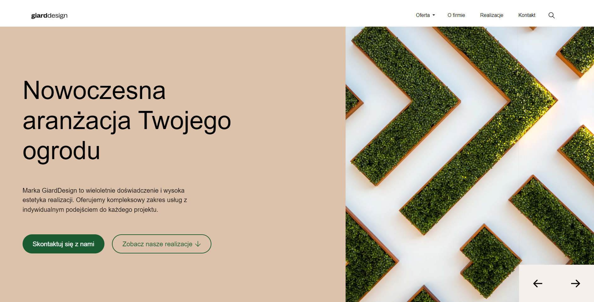
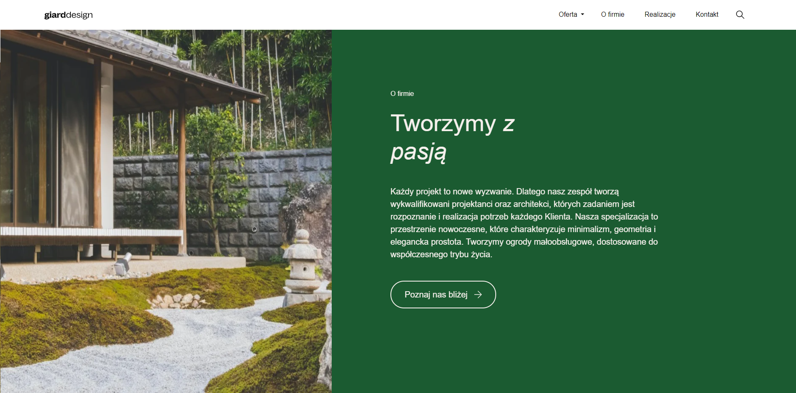

<h2>GiardDesign Project , but rewritten to Astro framework 🚀</h2>

<h3>Screenshots:</h3>

 

<h3>Link to the <a href="https://github.com/krystiano13/rtask">original project repo</a></h3>

<h3>Link to <a href="https://github.com/krystiano13/astro_rtask">live version</a></h3>

<h3>How to edit:</h3>
<ul>
    <li>Clone repo</li>
    <li>Run <b>"npm init"</b> to download dependencies</li>
    <li>Run <b>"npm run start"</b> to start local server</li>
    <li>Start editing :)</li>
</ul>
